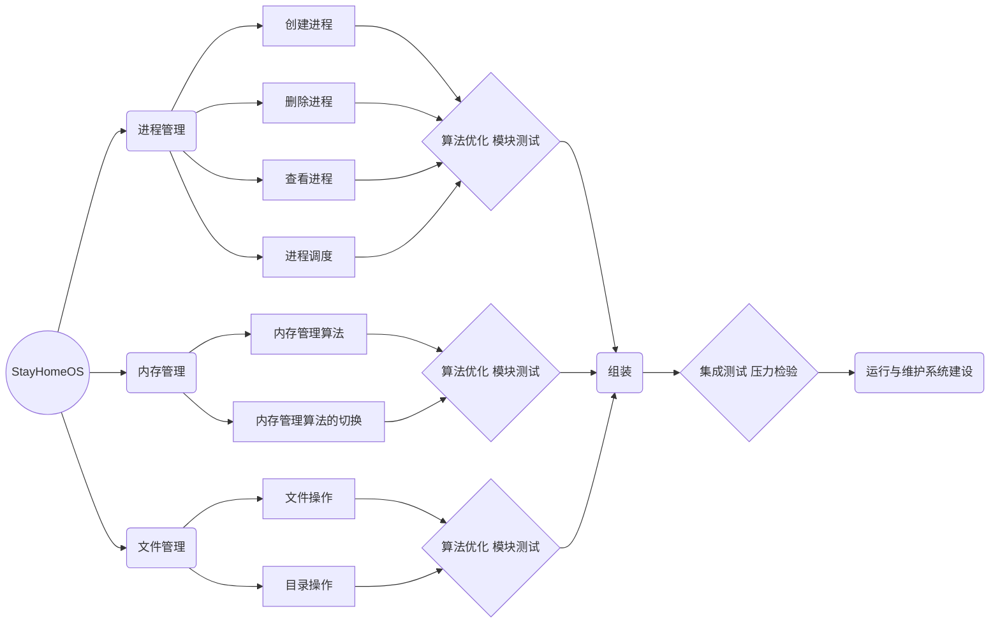

​	

```mermaid
graph LR
	A((StayHomeOS))-->B(进程管理)
		B-->C[创建进程]
		B-->D[删除进程]
		B-->E[查看进程]
		B-->F[进程调度]
			C-->G{算法优化 模块测试}
			D-->G
			E-->G
			F-->G
	A-->H(内存管理)
		H-->I[内存管理算法]
		H-->J[内存管理算法的切换]
			I-->K{算法优化 模块测试}
			J-->K
    A-->L(文件管理)
    		L-->M[文件操作]
    		L-->N[目录操作]
    			M-->O{算法优化 模块测试}
    			N-->O
	G-->P(组装)
	K-->P
	O-->P
	P-->Q{集成测试 压力检验}
	Q-->R(运行与维护系统建设)
```

